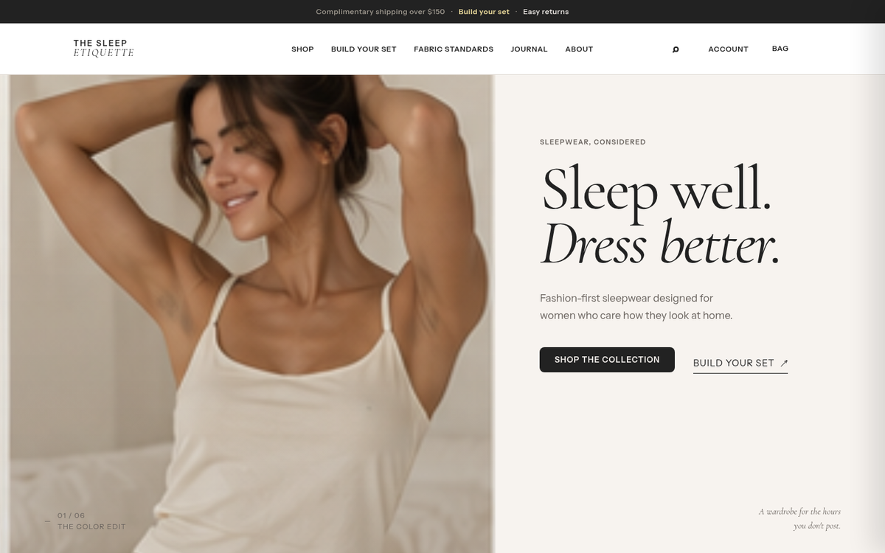
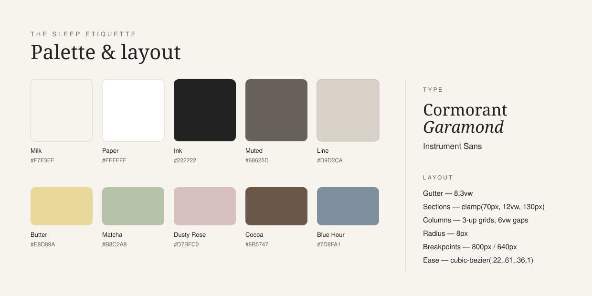

# The Sleep Etiquette

Fashion-first sleepwear. *Sleep well. Dress better.* A static multi-page storefront for a
sleepwear label — six pages, no build step, no framework, no dependencies.

**Live:** https://lianbeast.github.io/The-Sleep-Etiquette/

## Pages

| Page | What it is |
| --- | --- |
| `index.html` | Homepage — hero, bestsellers, set builder, reviews, journal teaser |
| `product.html` | Product detail — gallery, size/height/color pickers, quantity, add to bag |
| `standards.html` | Fabric Standards — the editorial spec of what the cloth is |
| `about.html` | About the label |
| `journal.html` | Journal with category filters |
| `coming-soon.html` | Single-screen waitlist capture with a generated bedroom hero |

## Palette & layout

The whole system is five neutrals and five fabric colours, set in two typefaces.

**Neutrals** — `Milk #F7F3EF` is the page ground, `Paper #FFFFFF` raises a section off it,
`Ink #222222` carries all type, `Muted #68625D` carries secondary type, `Line #D9D2CA` is the
only divider.

**Fabric colours** — the five colourways the collection actually sells in: `Butter #E8D89A`,
`Matcha #B8C2A8`, `Dusty Rose #D7BFC0`, `Cocoa #6B5747`, `Blue Hour #7D8FA1`. Each appears as
both a product swatch and a full-bleed section ground, so the shop never needs a colour the
collection does not have.

**Type** — Cormorant Garamond for display, Instrument Sans for everything else. The serif is
always the thing you read first; the sans never competes.

**Layout** — an 8.3vw gutter on every page, section rhythm of `clamp(70px, 12vw, 130px)`, 3-up
grids at 6vw gaps, 8px radii, and two breakpoints at 800px and 640px. All of it lives as custom
properties at the top of `styles.css:3` — change a token, the whole site follows.

## How it runs

- **No build.** Six HTML files, one `styles.css`, one `script.js`. Open `index.html` and it works.
- **Shared behaviour.** `script.js` is a single IIFE that no-ops on any element a page does not
  have, so all six pages share it safely.
- **Cart in `localStorage`.** The bag persists across pages and reloads without a server.
- **Deploy.** GitHub Pages, branch `main`, path `/`. Push to `main` and it goes live.

## Waitlist

`coming-soon.html` runs in local demo mode — `data-endpoint=""` means signups validate and
animate but never leave the browser. To collect real emails, point `data-endpoint` at a
collector (Formspree, a Mailchimp/ConvertKit proxy, or your own API) and the same handler
POSTs `{ email, name, source, page, at }` as JSON. See the comment above the form in
`coming-soon.html:46`.
